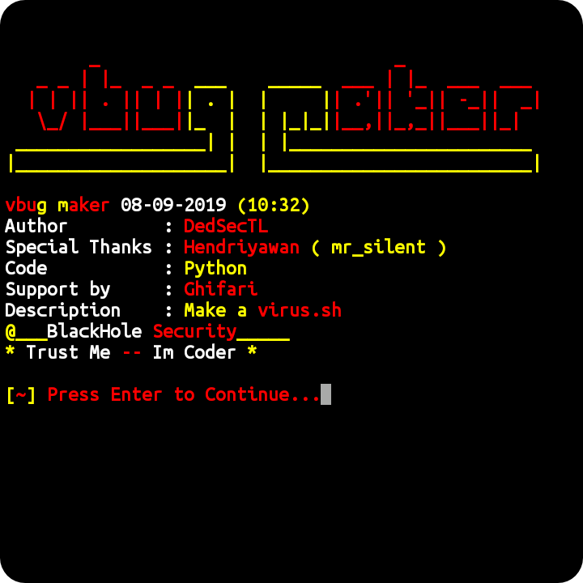
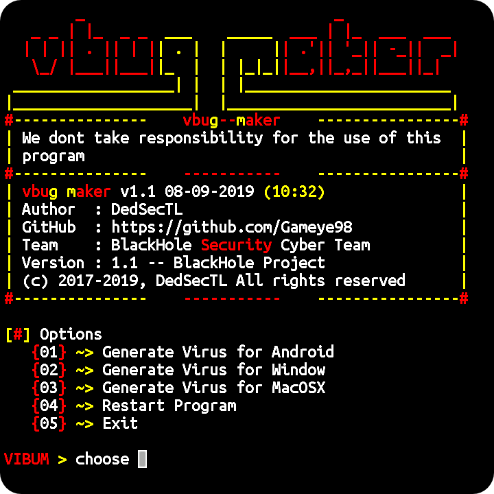

# vbug
**(ID)** Tool ini berfungsi untuk membuat virus secara instan. Dengan begitu pengguna vbug maker dapat menggunakannya dengan mudah dan cepat. Di dalam software tersebut telah disediakan 3 fitur yang bisa kita pilih, **Anvima ( Virus Untuk Android ), Winvima ( Virus untuk Windows ) & MACvima ( Virus untuk MACOSX )**  
**(EN)** This tool works to create viruses instantly. That way vbug maker users can use it easily and quickly. Inside the software has provided 3 features that we can choose, **Anvima (Virus For Android), Winvima (Virus for Window) & MACvima (Virus for MACOSX)**

## Screenshot
  


## Installation
```bash
apt-get update && apt-get upgrade
apt-get install git python
git clone https://github.com/Gameye98/vbug
cd vbug
python vbug.py
```

## Requirements
• Python 2.7.x  
• OS (Android, Linux)

## Find our team | BlackHole Security
[Telegram Group](https://t.me/BHSec)  
[GitHub](https://github.com/BlackHoleSecurity)

## Other project for vbug
1. vbug (CLI) for Windows | Written in PHP | Still working on.
2. vbug (GUI) for Windows | Written in Python | Not even want to started. LOL.